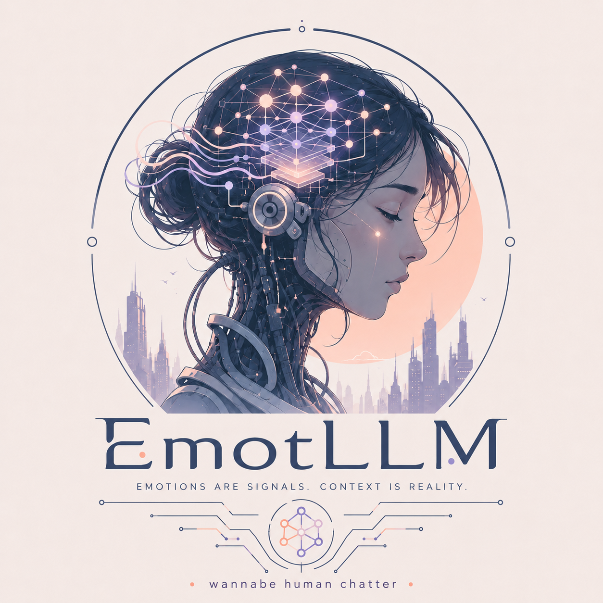

<table>
  <tr>
    <td width="320" valign="top">
      
    </td>
    <td valign="top">
      <h1>emot-llm</h1>
      <p><strong>Behavior-tree based, physiology-inspired emotional dynamics simulator for LLM agents.</strong></p>
      <p><code>emot-llm</code> wraps an LLM backend with a transparent, fictional affect-regulation layer. It uses <code>py_trees</code> to tick through input collection, LLM appraisal, optional webcam vision, dynamical emotional-state updates, memory recall/daydreaming, response generation, logging, and behavior-tree visualization. Its conversational role/persona starts as unknown or from presets and should develop only from explicit user framing, stable memory, and simulated state.</p>
    </td>
  </tr>
</table>

## Main features

- `py_trees` behavior tree execution.
- Tick-based physiology-inspired simulator from `deep-research-report.md`.
- Backends:
  - Ollama, default host `http://localhost:11434`
  - OpenAI/ChatGPT
  - OpenRouter
  - Gemini
- Optional webcam frame appraisal.
- Optional periodic auto-ticking while idle; off by default to avoid background API usage.
- Emotion-lensed memory:
  - structured JSONL memory traces
  - one consolidated human-readable `memory_summary.md`
  - idle daydream recall from the consolidated summary
  - normal conversational recall for continuity
- Optional raw LLM send/receive logging; off by default for privacy.
- DOT behavior-tree export plus terminal tree display.
- Unit tests with mocked LLM backends.

## Privacy and safety warning

`emot-llm` can create sensitive local artifacts when optional features are enabled:

- Session logs may include prompts, responses, simulator state, recalled memories, and backend errors.
- `--log-raw-llm` records raw text sent to and received from the model. It is off by default because prompts can contain private data.
- `--memory` writes affect-tagged conversation traces and a consolidated `memory_summary.md`; inspect or delete these files as needed.
- `--webcam` captures camera frames for appraisal. Frames are not saved unless `--save-webcam-frames` is enabled.

Do not use this project to simulate dependency, impersonate sentience, make psychiatric inferences, or manipulate users through attachment/memory. The interface should not invent a fixed persona, relationship, or social role before the conversation establishes one.

## Project layout

```text
src/emot_llm/
  cli.py             # Typer CLI loop
  tree.py            # py_trees behavior tree and tick pipeline
  state.py           # normalized state/appraisal/affect models
  dynamics.py        # multiscale simulator dynamics
  appraisal.py       # LLM appraisal and response prompts
  llm_backends.py    # Ollama, OpenAI, Gemini adapters
  webcam.py          # OpenCV frame capture
  memory.py          # emotion-lensed memory and daydream recall
  personality.py     # named markdown personality seeds
  personalities/     # built-in personality markdown files
  visualization.py   # ASCII/DOT tree helpers
  logging_utils.py   # JSONL session logs

assets/              # repo images/logo

tests/               # unit tests
requirements.txt
pyproject.toml
deep-research-report.md
```

## Installation

### Quick install from GitHub

Install with a single command:

```bash
curl -fsSL https://raw.githubusercontent.com/aamanku/emot-llm/main/scripts/install.sh | bash
```

Installer knobs:

```bash
EMOT_LLM_EXTRAS=ollama,openrouter \
EMOT_LLM_INSTALL_DIR="$HOME/.local/share/emot-llm" \
EMOT_LLM_BIN_DIR="$HOME/.local/bin" \
curl -fsSL https://raw.githubusercontent.com/aamanku/emot-llm/main/scripts/install.sh | bash
```

### Development install

Install the core CLI plus the backend(s) you plan to use:

```bash
pip install -e ".[ollama]"          # local Ollama backend
pip install -e ".[openai]"          # OpenAI backend
pip install -e ".[openrouter]"      # OpenRouter backend
pip install -e ".[gemini]"          # Gemini backend
pip install -e ".[webcam]"          # optional webcam support
pip install -e ".[dev]"             # tests + all backend/webcam adapters
```

Or install the development requirements directly:

```bash
pip install -r requirements.txt
```

## Quick start

Default Ollama backend, using `http://localhost:11434`:

```bash
emot-llm
```

Ollama thinking/reasoning traces are disabled by default. To explicitly enable them for supported models:

```bash
export EMOT_LLM_OLLAMA_THINK=true   # or: low, medium, high
```

If needed, pull a local model on your Ollama host:

```bash
ollama pull qwen3.5:9b
```

Use a different Ollama host:

```bash
emot-llm --ollama-host 192.168.1.50
```

OpenAI:

```bash
export OPENAI_API_KEY=...
emot-llm --backend openai --model gpt-4o-mini --vision-model gpt-4o-mini
```

OpenRouter:

```bash
export OPENROUTER_API_KEY=...
emot-llm --backend openrouter --model openai/gpt-4o-mini --vision-model openai/gpt-4o-mini
```

Optional OpenRouter metadata headers:

```bash
export OPENROUTER_HTTP_REFERER=https://your-project.example
export OPENROUTER_APP_TITLE=your-app-name
```

Gemini:

```bash
export GEMINI_API_KEY=...
# or: export GOOGLE_API_KEY=...
emot-llm --backend gemini --model gemini-2.5-flash --vision-model gemini-2.5-flash
```

## Common CLI commands

Inside the interactive CLI:

```text
/state          show current latent simulator state and affect vector
/tree           print current py_trees tree and write DOT
/memory         show consolidated memory and recent JSONL traces
/config         show persistent config and config path
/set KEY VALUE  save a config value and apply runtime-safe changes immediately
/reset          reset simulator state
/quit           exit
```

Examples:

```text
/set personality ramu
/set backend openrouter
/set model openai/gpt-4o-mini
/set auto_tick true
/set log_raw_llm false
/set webcam off
```

## Useful CLI options

```bash
emot-llm --help
```

Important options:

```text
--backend ollama|openai|openrouter|gemini
--personality NAME_OR_MD_PATH
--ollama-host HOST
--model MODEL
--vision-model MODEL
--webcam
--save-webcam-frames
--auto-tick / --no-auto-tick
--pause-after-no-input-ticks N
--memory / --no-memory
--memory-file PATH
--memory-summary-file PATH
--log-raw-llm / --no-log-raw-llm
--show-thinking
--dot-output PATH
--log-dir PATH
--seed N
```

## Persistent config

Runtime settings are stored as JSON at:

```text
~/.config/emot-llm/config.json
```

Override the path with:

```bash
export EMOT_LLM_CONFIG=/path/to/config.json
# or
export EMOT_LLM_CONFIG_DIR=/path/to/config-dir
```

CLI flags override the saved config for that launch. During an interactive run, `/set KEY VALUE` saves the value and applies runtime-safe settings immediately. Startup-only settings such as `log_dir`, `memory_file`, and `memory_summary_file` are saved for the next launch.

Common runtime-changeable keys:

```text
backend, personality, ollama_host, model, vision_model, tick_duration,
auto_tick, pause_after_no_input_ticks, webcam, save_webcam_frames,
camera_index, log_raw_llm, memory, max_memories, show_thinking
```

## Personalities

Built-in personality seeds live in:

```text
src/emot_llm/personalities/
```

Each personality is a markdown file with a name, role seed, style, adaptation rule, and safety boundary. The default is `genz-hype`, an upbeat likeable Gen Z-style seed. Other built-ins include `emergent`, `ramu`, `navigator`, and `mirror`.

Select at startup:

```bash
emot-llm --personality navigator --memory
```

Or change during a run:

```text
/set personality mirror
```

You can also provide a path to your own markdown personality file:

```bash
emot-llm --personality ./my-personality.md --memory
```

When memory is enabled, `memory_summary.md` starts with `# Active Personality`. During each memory summarization, the LLM is instructed to update this section gradually according to stable conversation context and the simulated emotional state. The CLI response panel title is derived from this active personality and current simulated affect phase.

Example with memory, still using the safer default of no automatic idle ticks:

```bash
emot-llm --memory
```

Example with explicit automatic idle ticks:

```bash
emot-llm --auto-tick --pause-after-no-input-ticks 3
```

Example with webcam and memory:

```bash
emot-llm --webcam --save-webcam-frames --memory
```

## Behavior tree pipeline

Each tick runs this sequence:

1. Collect text/webcam input.
2. Appraise input with the selected LLM backend.
3. Maybe recall/daydream from memory.
4. Update simulator dynamics.
5. Derive compact affect vector.
6. Recall relevant conversation memory.
7. Generate conditioned LLM response.
8. Store emotion-lensed memory.
9. Log and visualize.

Tree DOT files are written to the session log directory by default, or to `--dot-output`.

## Simulator state

The simulator uses normalized latent variables, not biological measurements.

State groups include:

- Interoception: cardio arousal, HRV/vagal tone, respiration strain, energy, sleep pressure, pain, nausea/disgust, inflammation, temperature deviation, circadian phase.
- Neuromodulators: dopamine, serotonin, central norepinephrine, glutamate, GABA, oxytocin, vasopressin.
- Endocrine variables: epinephrine, peripheral norepinephrine, CRH, ACTH, cortisol, testosterone, estradiol, progesterone.
- Circuit nodes: threat, reward, interoceptive salience, conflict/effort, context match, PFC control, social safety.
- Derived affect: valence, arousal, control, social safety, uncertainty, approach, fatigue, pain, trust, recovery phase.

## Memory model

When `--memory` is enabled, the system maintains two memory artifacts:

1. `memory.jsonl`
   - individual structured memory traces
   - includes user text, assistant text, appraisal, affect vector, emotional tone, and importance

2. `memory_summary.md`
   - one consolidated human-readable memory
   - rewritten/condensed by the LLM after each user input
   - defines current personality/context, stable names/preferences, emotional profile, good memories, bad memories, and open threads
   - authoritative source for idle daydream recall

During normal user input, relevant memory is retrieved for continuity. During idle automatic ticks, the simulator may daydream from the consolidated summary depending on mood/fatigue/control/uncertainty. When a daydream recall happens, `memory_summary.md` is also condensed/shortened and refreshed from that moment's simulated emotional state, so the active personality and memory profile evolve with valence, arousal, control, social safety, fatigue, trust, and recovery phase instead of growing indefinitely.

## Raw LLM logging

By default, session logs include simulator state and response metadata, but `raw_llm_io` is disabled. Enable it only when you are comfortable storing the exact prompts and model responses on disk:

```bash
emot-llm --log-raw-llm
```

Webcam image base64 is summarized by default to avoid huge logs. To log raw image base64 as well:

```bash
export EMOT_LLM_LOG_RAW_IMAGES=1
```

## Agent notes

For coding agents working on this repository:

- Read `deep-research-report.md` before changing dynamics.
- Keep the simulator transparent: never claim real emotion or consciousness.
- Prefer adding tests for behavior-tree changes, memory changes, and backend adapters.
- Avoid real API calls in tests; use mocked backends.
- `memory_summary.md` must remain a single consolidated summary, not append-only blocks.
- `memory.jsonl` is the append-only structured trace store.
- Daydream recall should use the latest `memory_summary.md` as the primary source.
- Normal input recall should use `memory_summary.md` plus relevant JSONL traces.
- Raw LLM logging should preserve prompt/response text while summarizing images unless explicitly overridden.


