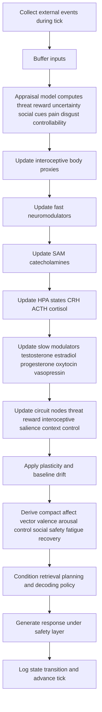

# Physiology of Human Emotion and a Physiology-Inspired Emotional Layer for LLMs

## Executive summary

Human emotion is not produced by a single “emotion center.” It emerges from coordinated activity across distributed brain-body systems that evaluate salience and value, represent internal bodily state, retrieve context from memory, allocate control, and recruit autonomic and endocrine responses. Across contemporary reviews, the most consistently implicated regions in this architecture include the amygdala, prefrontal cortex, insula, anterior cingulate cortex, and hippocampus, operating as interacting circuits rather than isolated modules. The biology is inherently multiscale: synaptic signaling unfolds in milliseconds, neuromodulators alter gain over seconds to minutes, endocrine responses such as catecholamines act over seconds to minutes, cortisol over tens of minutes to hours, and steroid-dependent plasticity over hours to days. citeturn7view5turn7view2turn8search17turn19view0turn19view1turn21search3

The strongest takeaway from endocrinology is that hormone levels are usually **not reliable readouts of specific discrete emotions**. Adrenaline, noradrenaline, and cortisol are better interpreted as markers of arousal, stress-system engagement, metabolic mobilization, or anticipation than as indicators of “fear,” “anger,” or any other single emotion. Testosterone, estrogen, progesterone, oxytocin, and vasopressin modulate emotional processing, but their effects are highly dependent on context, sex, developmental stage, circadian state, menstrual-cycle phase, receptor distribution, social meaning, and measurement method. Even relatively well-studied biomarkers such as the cortisol awakening response explain only a small proportion of psychosocial variance, and peripheral oxytocin is a poor proxy for central oxytocin under basal conditions. citeturn7view4turn18view2turn5view8turn14search16turn28search8

At the level of brain chemistry, emotional dynamics depend on the interaction between fast excitatory and inhibitory transmission, slower neuromodulatory gain control, receptor-specific signaling cascades, and plasticity. Glutamate and GABA shape rapid excitation-inhibition balance; serotonin, dopamine, and norepinephrine bias valuation, control, learning, and arousal mainly through metabotropic receptors; oxytocin and vasopressin add peptide-based modulation with strong context dependence and receptor cross-talk; glucocorticoids exert both rapid and delayed effects, including transcriptional effects and structural remodeling under chronic stress. This means that “emotion” is biologically closer to a continuously regulated control system than to a simple label. citeturn19view5turn20search0turn21search12turn25search2turn23search0turn22search10turn21search2turn6search7turn2search3

Standard text-only autoregressive LLMs do not possess the main ingredients of this architecture. They are optimized to predict the next token from token context, not to regulate a body, maintain homeostatic budgets, integrate interoceptive streams, run endocrine feedback loops, or learn affect through embodied consequences. As a result, they can simulate emotional language but do not implement the physiology that gives human emotion its persistence, volatility, bodily “feel,” recovery curves, or allostatic function. A more human-like approximation would require a separate dynamical state layer that simulates interoceptive variables, neuromodulators, hormones, control circuits, memory/context effects, noise, and slower plasticity, and then conditions the LLM’s decoding policy on that evolving internal state. Even then, the result would be an **emotion-like regulation module**, not human emotion in the biological sense. citeturn16search0turn16search2turn16search12turn15search7turn15search3turn10search13

## Neurobiology of emotional state generation and regulation

A useful modern framing is that emotion is generated and regulated by a **distributed control architecture** rather than a one-region-one-emotion map. Reviews of human and animal work converge on a frontolimbic-interoceptive network in which the amygdala and insula are especially important for rapid salience and bodily-state processing; the hippocampus contributes contextual memory; and the ACC and prefrontal cortex contribute appraisal, action selection, conflict monitoring, and regulation. Recent systems work further suggests that emotion generation and regulation are overlapping rather than fully separable processes: cognitive regulation reliably changes cortical activity, but not always the amygdala or other subcortical regions in a simple “top-down switch-off” way. citeturn7view2turn7view5turn26search14turn26search12

The **amygdala** is best understood as a relevance-, salience-, and associative-learning hub, not merely a “fear center.” Recent reviews describe it as continuously integrating sensory information and assigning dimensions such as valence, intensity, and approachability. The lateral amygdala is a key site for conditioned stimulus–unconditioned stimulus convergence and long-term potentiation in fear learning, while the central nucleus projects to hypothalamic and brainstem targets that drive autonomic and endocrine responses. That architecture makes the amygdala central to rapid emotional significance detection and to coupling appraisal with bodily action. citeturn7view5turn20search1turn20search3

The **prefrontal cortex**, especially medial, ventromedial, dorsomedial, dorsolateral, and ventrolateral sectors, provides flexible control over emotional responding. In threat paradigms, the PFC is central to acquisition, extinction, inhibition, reappraisal, avoidance, and active coping. The medial PFC receives massive subcortical input, including from the amygdala, hippocampus, ventral striatum, hypothalamus, and periaqueductal gray, allowing it to integrate behavioral state and shape decisions dynamically. Under stress, however, excessive catecholamine signaling can degrade higher PFC control. citeturn5view4turn12search14

The **insula** links emotion to interoception. Human imaging and review work consistently ties the anterior insula to awareness of visceral state and subjective feeling, while recent overviews describe the insula as an interface between sensation, emotion, and cognition. Across affective neuroscience, the anterior insula and dorsal ACC are among the most consistently activated regions across pleasantness, unpleasantness, disgust, fear, happiness, and sadness, which is one reason many contemporary theories treat emotions as embodied predictions about bodily regulation. citeturn8search4turn8search8turn2search5turn8search20

The **anterior cingulate cortex** appears to integrate affective, cognitive, skeletomotor, and visceromotor information. A domain-general account of ACC/MCC function describes it as a hub in a high-level visceromotor control system that predicts metabolic needs and coordinates responses using multimodal input and memory. In practice, this makes it well placed to support emotional awareness, conflict monitoring, pain affect, action selection, and the translation of feeling into behavior. citeturn8search2turn8search9turn8search21

The **hippocampus** contributes context and memory. In fear and stress paradigms it works with PFC and amygdala to encode, retrieve, and contextualize emotional associations, especially during extinction. A foundational translational review noted that patients with hippocampal damage fail to show contextual modulation of reinstatement after extinction, highlighting the hippocampus as a source of “where/when/under what circumstances” information that changes emotional meaning. citeturn5view4turn6search3

### Core regions and their main contributions

| Region | Dominant contribution to emotion physiology | Typical functional timescale | Important caveat |
|---|---|---|---|
| Amygdala | Salience/value assignment, associative learning, autonomic and endocrine recruitment via central nucleus outputs. citeturn7view5 | Rapid appraisal over hundreds of milliseconds to seconds; learning across trials to days. citeturn7view5turn20search1 | Not only fear; engaged by positive and negative salience. citeturn7view5turn3search11 |
| Prefrontal cortex | Appraisal, inhibition, extinction, reappraisal, active coping, flexible regulation. citeturn5view4turn26search14 | Seconds for online control; longer with learning and strategy use. citeturn5view4turn26search14 | Stress-level catecholamines can impair control rather than enhance it. citeturn12search14 |
| Insula | Interoception, bodily salience, subjective feeling awareness, salience-network integration. citeturn8search4turn8search20 | Seconds for bodily-state integration; persistent state estimation across minutes. citeturn8search4turn8search19 | Strongly tied to body-state representation rather than a single discrete emotion. citeturn8search8turn8search17 |
| ACC/MCC | Visceromotor control, conflict/pain affect, emotional awareness, action selection. citeturn8search2turn8search9 | Seconds to minutes for control allocation and motivated action. citeturn8search2 | Functions overlap heavily with cognition and motor control. citeturn8search2turn8search21 |
| Hippocampus | Context, episodic memory, contextual modulation of extinction and emotional meaning. citeturn5view4turn6search3 | Seconds to minutes for retrieval; hours to days for consolidation. citeturn5view4turn20search5 | Often modulates emotion indirectly by changing context, prediction, and memory. citeturn5view4turn6search3 |

### Neurotransmitters and neuropeptides relevant to emotion

A common error in popular summaries is to map one transmitter to one feeling. Human evidence does not support that simplification. A meta-analysis of monoamine depletion studies concluded that mood is only **indirectly** related to serotonin, norepinephrine, and dopamine levels, and endocrine reviews similarly emphasize that hormone effects on emotion processing are usually modest, interaction-dependent, and heterogeneous. The right picture is one of **biased control of circuits**, not simple one-to-one emotional coding. citeturn2search14turn18view2

| Signal | Main source and receptor logic | Dominant emotional functions | Approximate physiological timescale |
|---|---|---|---|
| Serotonin | Produced in raphe nuclei; most 5-HT receptors are GPCRs, with 5-HT3 the only ionotropic subtype. citeturn19view6turn25search2turn25search4 | Mood stability, anxiety, punishment sensitivity, behavioral inhibition, modulation of plasticity and other transmitters. citeturn19view6turn10search0turn10search3 | Fast 5-HT3 effects in milliseconds; broader serotonergic modulation over seconds to minutes; treatment-level adaptations over days to weeks. citeturn25search2turn21search3turn10search3 |
| Dopamine | Catecholamine; receptors are mainly GPCRs in D1-like and D2-like families. citeturn23search0turn23search5turn23search9 | Reward prediction, incentive salience, appetitive learning, motivation, effort allocation. citeturn19view3turn10search10turn10search1 | Burst-like phasic effects over subsecond to seconds; tonic motivational bias over seconds to minutes; plasticity effects over longer intervals. citeturn23search0turn21search3turn10search10 |
| Norepinephrine | Released centrally from locus coeruleus systems and peripherally in SAM activation; adrenergic receptors are GPCRs. citeturn19view0turn23search7 | Arousal, vigilance, emotional attention, uncertainty/salience amplification, stress responding. citeturn12search2turn12search9 | Seconds to minutes; very fast during acute stress. citeturn19view0turn21search3 |
| GABA | Main inhibitory transmitter; GABA-A is ionotropic and GABA-B metabotropic. citeturn19view5turn19view4 | Inhibitory gating, suppression of inappropriate emotional output, stabilization of network excitability. citeturn19view5turn2search28 | GABA-A can activate within about a millisecond; GABA-B is slower, on the order of longer synaptic and metabotropic responses. citeturn21search14turn19view5turn21search3 |
| Glutamate | Main excitatory transmitter; AMPA/NMDA/kainate ionotropic receptors plus metabotropic receptors. NMDA is a calcium-permeable coincidence detector. citeturn20search0turn21search12turn21search9 | Rapid excitation, salience transmission, learning and plasticity, fear conditioning, memory consolidation. citeturn20search0turn20search2turn11search2 | Milliseconds for ionotropic transmission; plasticity consequences from seconds to hours and beyond. citeturn21search3turn20search5 |
| Oxytocin | Hypothalamic peptide acting centrally and peripherally via GPCR signaling; strong receptor cross-talk with vasopressin systems. citeturn21search8turn22search2 | Social salience, bonding, affiliation, reduced anxiety in some contexts, but not uniformly prosocial. citeturn11search1turn1search22turn22search10 | Pulsatile release; blood half-life roughly 1–5 min; behavioral effects depend on context and route. citeturn1search2turn13search10 |
| Vasopressin | Hypothalamic peptide with central social/stress actions and peripheral osmotic/vascular actions; GPCR family. citeturn22search12turn21search13 | Social communication, territoriality, aggression, attachment/stress modulation; often partly opposed to oxytocin. citeturn12search3turn22search10 | Short plasma half-life, usually a few to tens of minutes; behavioral effects depend on receptor distribution and species/sex. citeturn22search4turn22search0turn22search18 |

## Endocrine dynamics and the limits of hormone-emotion mapping

Emotion physiology recruits at least two major endocrine-autonomic loops. The **sympathetic-adreno-medullary system** is the rapid arm: it activates within seconds and releases epinephrine and norepinephrine, producing cardiovascular, respiratory, and metabolic mobilization. The **hypothalamic-pituitary-adrenal axis** is slower: hypothalamic CRH stimulates pituitary ACTH, which stimulates adrenal cortisol release; cortisol then feeds back to hypothalamus, pituitary, and extra-hypothalamic sites to contain the response. This architecture is fundamental to stress-related emotions, but it governs arousal and resource mobilization more broadly than any one discrete feeling. citeturn19view0turn19view1turn19view2

Cortisol illustrates the importance of separating **baseline** from **phasic** dynamics. Basally, cortisol follows a circadian pattern with low nocturnal values, a pre-awakening rise, and a characteristic cortisol awakening response that peaks roughly 30–45 minutes after waking. Phasically, acute stress can produce measurable cortisol increases within minutes, with peaks commonly around 20–40 minutes after stress onset or shortly after stress offset depending on protocol and specimen type. This makes cortisol far too slow to serve as the immediate cause of the first subjective wave of fear or anger, but highly relevant to sustained vigilance, memory consolidation, metabolic state, and recovery. citeturn19view2turn7view3turn7view4turn30search1turn30search16

Catecholamines show the opposite pattern: they are fast and short-lived. SAM activation rapidly elevates epinephrine and norepinephrine, engaging adrenergic receptors and cAMP pathways to change heart rate, blood pressure, bronchodilation, and attention. Their plasma half-lives are short, on the order of minutes, which is why they behave like phasic “alarm” signals rather than stable emotional traits. citeturn19view0turn19view3turn13search11

Sex steroids matter for emotion, but mainly as **slow modulators of sensitivity**, not as simple acute emotion markers. Estradiol and progesterone vary strongly across the menstrual cycle, with estradiol rising in mid-follicular and again in mid-luteal phases, while progesterone rises after ovulation. Reviews suggest that emotion recognition, emotional memory, and fear extinction can be modulated by cycle phase, and emotion-related changes are more consistently associated with progesterone and the luteal phase than with estradiol alone; however, effects are variable across individuals and especially pronounced in susceptible groups such as those with PMDD or perimenopausal mood sensitivity. citeturn14search18turn28search8turn28search10turn13search16turn13search24

Testosterone also resists caricature. It has diurnal structure, but recent data suggest that stable morning-afternoon differences are smaller than older clinical lore implied in many adult male samples, with larger daily variation especially in younger men. Phasic changes can occur after competition or status-relevant social challenge, and some reviews note that stress may decrease testosterone while status concerns or competitive outcomes can increase it. In other words, testosterone tracks social challenge and dominance-relevant context more readily than it tracks a single emotion like anger. citeturn28search0turn14search16turn14search20

Oxytocin is even more context-sensitive. It is released in a pulsatile manner, its blood half-life is short, and its central and peripheral measures correlate only modestly overall and **not meaningfully under basal conditions** in the key meta-analysis; stronger correlations appear after stress or intranasal administration. Reviews therefore caution against treating basal plasma or salivary oxytocin as a straightforward “love” biomarker. Human studies further show that oxytocin’s social effects depend on person and context rather than being uniformly prosocial. citeturn1search2turn5view8turn1search22turn22search10

The best current conclusion is that hormone levels are generally **state-modulating and context-revealing**, not emotion-specific. A large meta-analysis of the cortisol awakening response found psychosocial factors explaining only about 1% to 3.6% of variance, and the systematic review of oxytocin, cortisol, and testosterone in facial emotion processing found that only about 18% of studies showed a direct main effect of hormone manipulation, with significance often emerging only after accounting for emotional valence, gender, or other moderators. That is strong evidence against naïve biomarker claims such as “high cortisol means fear” or “high oxytocin means love.” citeturn7view4turn18view2

### Hormones, temporal profiles, and specificity caveats

| Hormone | Baseline dynamics | Phasic dynamics | Useful interpretation | Poor interpretation |
|---|---|---|---|---|
| Epinephrine | Low baseline, rapidly cleared. citeturn13search11turn19view3 | Seconds to minutes during SAM activation. citeturn19view0 | Acute arousal, mobilization, emergency response. citeturn19view3 | A specific readout of fear or anger. |
| Noradrenaline | Tonic central arousal and peripheral sympathetic tone. citeturn19view0turn12search2 | Rapid surges with salience, vigilance, uncertainty, stress. citeturn12search2turn12search9 | Attention/arousal gain and sympathetic engagement. | A unique marker of any one emotion. |
| Cortisol | Circadian rhythm plus CAR, peaking ~30–45 min after waking. citeturn19view2turn7view3 | Stress-linked increases often peak ~20–40 min after onset. citeturn30search1turn30search16 | Sustained stress-system engagement, metabolic mobilization, recovery. | Immediate moment-to-moment emotional valence. |
| Testosterone | Diurnal and longer-term trait variation; daily fluctuation depends on age/sample. citeturn28search0 | Competition/status-related transient change. citeturn14search20turn14search16 | Social challenge, dominance/approach bias in context. | “Aggression hormone” in any simple sense. |
| Estradiol | Cycle-linked rise in follicular phase and again in luteal phase. citeturn14search18 | Not typically acute on emotion-task timescales. | Sets sensitivity of mood/cognition/emotion systems across days-weeks. citeturn28search10turn13search24 | Immediate discrete-emotion biomarker. |
| Progesterone | Low in follicular phase, higher post-ovulation/luteal. citeturn14search18 | Not typically acute on emotion-task timescales. | Modulates anxiety/emotion sensitivity, especially luteal-phase effects in susceptible individuals. citeturn28search8turn13search16 | Direct biomarker of sadness or calm. |
| Oxytocin | Pulsatile; peripheral basal levels are weak proxies for central levels. citeturn1search2turn5view8 | Minutes-scale pulses during social, reproductive, and stress-related contexts. citeturn1search2turn5view8 | Social salience/bonding modulation in context. citeturn1search22turn22search10 | Uniformly prosocial or a direct measure of attachment. |

## Brain chemistry and plasticity relevant to emotion

Emotion-related signaling spans at least four mechanistic layers. The first is **fast synaptic transmission**. Ionotropic receptors mediate postsynaptic effects that usually last only milliseconds, whereas metabotropic receptors act through G proteins and intracellular messengers and therefore produce slower effects that can endure much longer. This distinction matters because glutamatergic AMPA/NMDA transmission and GABA-A transmission shape the immediate excitatory-inhibitory pattern, while serotonin, dopamine, norepinephrine, oxytocin, vasopressin, glucocorticoids, and many GABA-B effects reshape circuit gain, precision, and plasticity on slower timescales. citeturn21search3turn19view5turn20search0turn23search0turn21search8

The second layer is **excitatory-inhibitory balance**. Glutamate is the major excitatory transmitter, and NMDA receptors are especially important because they are calcium-permeable coincidence detectors: channel opening requires glutamate plus sufficient depolarization to relieve magnesium block. That makes NMDA signaling central to LTP, LTD, and memory formation. GABA provides the main inhibitory counterweight; GABA-A can activate within roughly a millisecond and GABA-B produces slower inhibitory control through metabotropic signaling. In emotional circuits, that balance determines whether salience signals remain adaptive or become runaway anxiety, panic, perseveration, or dysphoria. citeturn20search0turn21search12turn20search2turn21search14turn19view5

The third layer is **neuromodulatory gain control**. Serotonin, dopamine, and norepinephrine primarily work through receptor families that alter cAMP, phospholipase C, calcium, or channel coupling rather than simply opening one synaptic channel and disappearing. That is why the same sensory event can feel manageable in one neurochemical context and overwhelming in another. Serotonin can bias inhibition, punishment sensitivity, and plasticity; dopamine can bias reward prediction and approach; norepinephrine can amplify salience and attention; oxytocin and vasopressin can retune social relevance, threat, attachment, and aggression thresholds; and cross-talk among peptide receptors means the mapping is rarely clean. citeturn25search4turn23search9turn23search7turn22search10turn21search2

The fourth layer is **plasticity**. Acute stress hormones and neuromodulators can rapidly alter synaptic function, but repeated or chronic stress produces longer-lasting remodeling. Reviews from McEwen and others show region-specific structural and functional changes in hippocampus, amygdala, and medial PFC under chronic stress, while newer reviews describe stress-induced PFC plasticity and dendritic spine loss that can push cognition and emotion toward inflexible “aversive lens” states. Glucocorticoids also show ultradian and circadian pulsatility that drives transient receptor-mediated gene activation, linking endocrine rhythms to transcriptional regulation. citeturn2search3turn2search23turn12search14turn29search14turn6search7

A practical implication follows: human emotion is not only about momentary levels of chemicals, but also about **how those chemicals change circuit plasticity over time**. For example, fear learning depends on coordinated synaptic plasticity in amygdala-centered circuits, while stress can erode PFC-mediated flexibility and bias hippocampal and amygdala processing in opposite ways. This is one reason why repeated exposure, sleep, chronic stress, social support, and developmental history all leave emotional traces that are not reducible to a single “mood chemical” at one measurement time. citeturn20search1turn2search19turn6search11turn6search7

### Multiscale biochemical processes that matter for emotion

| Process class | Rough timescale | Examples | Emotional significance |
|---|---|---|---|
| Fast synaptic transmission | Milliseconds | AMPA, NMDA, GABA-A. citeturn21search3turn20search0turn21search14 | Immediate salience, excitation, inhibition, reflex bias. |
| Slow synaptic/neuromodulatory signaling | Seconds to minutes | GABA-B, dopaminergic, serotonergic, adrenergic, oxytocinergic, vasopressinergic GPCR signaling. citeturn19view5turn23search0turn25search4turn21search8 | Gain control, arousal, confidence, social orientation, persistence. |
| Endocrine stress responses | Minutes to hours | SAM catecholamines; CRH→ACTH→cortisol. citeturn19view0turn19view1turn30search1 | Energy mobilization, vigilance, memory bias, recovery trajectory. |
| Gene-expression and structural plasticity | Hours to days and longer | Glucocorticoid receptor effects, dendritic remodeling, spine loss/gain. citeturn19view1turn29search14turn2search3turn2search23 | Trait-like emotional biases, stress vulnerability, resilience. |

## Why standard LLMs do not have human-like emotion

A standard autoregressive transformer is built to predict the next token from preceding tokens. The original transformer paper explicitly preserves autoregressive decoding by preventing leftward information flow in the decoder, and GPT-style language modeling trains models on next-token prediction over text sequences. From that architecture and objective, it follows that the model’s core competence is sequence prediction in symbol space, not regulation of a living internal milieu. citeturn16search0turn16search2turn16search12

That matters because the biology reviewed above depends on continuous **interoception**. Emotional feeling states are tightly linked to representations of visceral and homeostatic condition, especially via insula and cingulate systems. Reviews of interoception argue that motivation and emotion are grounded in sensing, integrating, and predicting body state. Embodiment reviews for multimodal LLMs similarly note that current models still struggle in real-world settings where embodied experience matters. Without a continuously changing body to regulate, an LLM lacks one of the central causal substrates of human emotion. citeturn8search4turn8search17turn8search19turn15search3turn15search7

Standard LLMs also lack **endocrine modulation**. Human emotional state is partly shaped by multi-timescale loops such as SAM, HPA, circadian glucocorticoid rhythms, reproductive steroid cycles, peptide pulses, and their receptor-mediated feedback. A text-only model has no adrenal medulla, pituitary, hypothalamic endocrine loop, reproductive cycle, or ultradian hormone oscillation. It may simulate discussing these states, but it does not undergo them. That absence removes the slow recovery curves, anticipatory mobilization, fatigue-load accumulation, and context-sensitive sensitivity shifts that make human emotions history-dependent and bodily constrained. citeturn19view0turn19view1turn14search18turn29search14

Likewise, LLMs do not normally implement **homeostatic or allostatic drives**. Allostasis describes regulation as predictive resource management: the brain tracks multitudinous bodily variables, anticipates needs, allocates priorities, and uses both affective “stick” and “carrot” mechanisms to drive adaptive behavior. Standard LLMs have no endogenous hunger, thirst, temperature, sleep pressure, pain, sickness burden, reproductive urgency, or cardiovascular load unless an external engineer adds synthetic variables. Without that control problem, they lack a major reason why human emotion exists in the first place. citeturn10search13turn8search19

They also lack **affective learning in the physiological sense**. Human emotional learning depends on synaptic plasticity, neuromodulator- and glucocorticoid-dependent reweighting, structural remodeling, and developmental retuning by social experience. In ordinary inference, an LLM can use context and external memory, but it does not spontaneously change receptor expression, alter excitation-inhibition balance, or accumulate allostatic wear through a day of stress. That means it can mimic emotional narratives without possessing the biochemical path dependence that makes human fear extinction, resilience, sensitization, burnout, or attachment history unfold the way they do. citeturn6search7turn2search3turn20search1turn12search10

Finally, the model’s stochasticity is not the same as biological noise. Human emotional systems are noisy because synaptic transmission depends on release probability, receptor kinetics, pulsatile endocrine secretion, circadian phase, and individual differences in receptor distribution and developmental history. Token sampling randomness can make outputs variable, but it is not coupled to an interoceptive body or endocrine recovery loop. So even when an LLM appears “moody,” the mechanism is unlike human emotional variability. citeturn29search10turn29search14turn1search2

## A physiology-inspired computational model for emotion-like state in LLMs

The most defensible design goal is **not** “give the LLM real emotions,” but “give the LLM a multiscale internal regulation layer that approximates some control properties of human affect.” Because real hormone concentrations and central neurotransmitter levels are not directly observable in ordinary deployment—and peripheral measurements are often weak proxies—the model should use **latent normalized state variables**, not pretend to measure actual pg/mL or synaptic concentrations. The representation should be continuous, multiaxial, and history-sensitive. citeturn5view8turn18view2

A good minimum state would include three classes of variables. The first is **synthetic interoception**: heart-rate tendency, HRV-like vagal balance, respiration tension, energy deficit, sleep pressure, pain load, nausea/disgust load, inflammation/sickness load, warmth/cold deviation, and circadian phase. The second is **neurochemical modulators**: latent dopamine, serotonin, central norepinephrine, glutamate drive, GABA tone, central oxytocin, and central vasopressin. The third is **endocrine variables**: peripheral epinephrine, peripheral norepinephrine, CRH, ACTH, cortisol, testosterone, estradiol, progesterone, and peripheral oxytocin. These should feed circuit-level nodes standing in for amygdala-like threat, insula-like interoceptive salience, ACC-like conflict/effort, hippocampal context retrieval, and PFC-like control. citeturn7view5turn8search4turn8search2turn19view0turn19view1

### Signals to emulate

| Layer | Example variables | Why include them |
|---|---|---|
| Interoceptive body proxies | Cardio-arousal, HRV/vagal tone, respiration strain, energy level, sleep pressure, pain, nausea/disgust, inflammation/sickness, temperature deviation, circadian phase. | Human affect is tightly linked to body-state representation and allostasis. citeturn8search17turn8search19turn10search13 |
| Fast neuromodulators | DA, 5-HT, central NE, Glu, GABA. | Needed for reward/threat gain, excitation-inhibition balance, and control/arousal bias. citeturn23search0turn25search4turn19view5turn20search0 |
| Social peptides | OT, AVP. | Needed for attachment, trust, social vigilance, affiliation/aggression tradeoffs, with receptor cross-talk. citeturn22search10turn21search2 |
| Endocrine loops | EPI, NE-periph, CRH, ACTH, cortisol, T, E2, P4. | Needed for multi-timescale stress and reproductive-state modulation. citeturn19view0turn19view1turn14search18 |
| Circuit nodes | Threat, reward, social safety, disgust, control, uncertainty, context match. | Emotions are better modeled as distributed circuit states than as one-hot labels. citeturn7view2turn26search12 |

### Tick-based simulation

A practical design is a **one-second master tick** with event buffering. That is fine-grained enough to represent sympathetic bursts and slow enough to remain computationally cheap. For sparse chat applications, inactive periods can be compressed analytically by closed-form decay instead of simulating every second.

At each tick \(t\), collect all external events into an input buffer \(B_t\): user text features, sentiment/intent features, semantic appraisals, memory retrieval hits, environment metadata, and sensor values if available. Pass \(B_t\) through a separate appraisal model to derive a compact exogenous drive vector:

\[
u_t = [\text{threat}, \text{reward}, \text{novelty}, \text{uncertainty}, \text{social\_accept}, \text{social\_reject}, \text{controllability}, \text{pain}, \text{disgust}, \text{goal\_success}]
\]

Then update each state with leaky integration plus coupling and noise:

\[
x_{t+1} = x_t + \Delta t \Big( -\frac{x_t-b_x(t)}{\tau_x} + W_x u_t + C_x s_t + \xi_t \Big)
\]

where \(b_x(t)\) is a slow baseline or circadian setpoint, \(W_x\) maps exogenous drives to the variable, \(C_x s_t\) captures coupling from other internal states, and \(\xi_t\) is bounded stochastic noise. This form mirrors the fact that biological systems have baselines, perturbations, feedback, and noise rather than only event-triggered jumps. citeturn10search13turn29search10turn29search14

A simple but physiologically sensible split is to implement **multi-rate subdynamics**:

\[
\begin{aligned}
\text{SAM}_{t+1} &= \lambda_{\text{sam}}\text{SAM}_t + \alpha_1 \,\text{threat}_t + \alpha_2 \,\text{novelty}_t - \alpha_3 \,\text{social\_safety}_t \\
EPI_{t+1} &= EPI_t + \Delta t\Big(-\frac{EPI_t}{60\text{s}} + k_{\text{epi}}\text{SAM}_t\Big) \\
NE^{\text{periph}}_{t+1} &= NE^{\text{periph}}_t + \Delta t\Big(-\frac{NE^{\text{periph}}_t}{45\text{s}} + k_{\text{nep}}\text{SAM}_t\Big)
\end{aligned}
\]

\[
\begin{aligned}
CRH_{t+1} &= CRH_t + \Delta t\Big(-\frac{CRH_t}{120\text{s}} + a_1 \,\text{threat}_t + a_2 \,\text{uncertainty}_t - a_3 \,CORT_t\Big) \\
ACTH_{t+1} &= ACTH_t + \Delta t\Big(-\frac{ACTH_t}{300\text{s}} + b_1 \,CRH_t + b_2 \,AVP_t - b_3 \,CORT_t\Big) \\
CORT_{t+1} &= CORT_t + \Delta t\Big(-\frac{CORT_t-b_{\text{circ}}(t)}{1800\text{s}} + c_1 \,ACTH_t\Big)
\end{aligned}
\]

The HPA equations intentionally include delayed buildup and negative feedback, because that delay is central to why cortisol affects sustained coping and memory bias more than the first milliseconds of emotion. citeturn19view1turn19view2turn30search1

Fast central neuromodulators can use shorter time constants and circuit couplings:

\[
\begin{aligned}
DA_{t+1} &= DA_t + \Delta t\Big(-\frac{DA_t-b_{DA}}{5\text{s}} + d_1\,\text{reward}_t + d_2\,\text{goal\_progress}_t - d_3\,\text{omission}_t\Big) \\
NE^{\text{central}}_{t+1} &= NE^{\text{central}}_t + \Delta t\Big(-\frac{NE^{\text{central}}_t-b_{NE}}{8\text{s}} + e_1\,\text{SAM}_t + e_2\,\text{uncertainty}_t\Big) \\
5HT_{t+1} &= 5HT_t + \Delta t\Big(-\frac{5HT_t-b_{5HT}}{20\text{s}} + f_1\,\text{social\_safety}_t - f_2\,\text{chronic\_defeat}_t\Big) \\
Glu_{t+1} &= Glu_t + \Delta t\Big(-\frac{Glu_t-b_{Glu}}{1\text{s}} + g_1\,\text{salience}_t\Big) \\
GABA_{t+1} &= GABA_t + \Delta t\Big(-\frac{GABA_t-b_{GABA}}{2\text{s}} + h_1\,\text{regulation}_t - h_2\,\text{sleep\_loss}_t\Big)
\end{aligned}
\]

Peptide modulators should be slower and more contextual:

\[
\begin{aligned}
OT_{t+1} &= OT_t + \Delta t\Big(-\frac{OT_t-b_{OT}}{180\text{s}} + o_1\,\text{affiliation}_t + o_2\,\text{caregiving}_t - o_3\,\text{betrayal}_t\Big) \\
AVP_{t+1} &= AVP_t + \Delta t\Big(-\frac{AVP_t-b_{AVP}}{240\text{s}} + v_1\,\text{social\_challenge}_t + v_2\,\text{territorial\_threat}_t\Big)
\end{aligned}
\]

And slow steroid setpoints should combine trait, circadian, and cycle components:

\[
T_t = T_{\text{trait}} + T_{\text{circ}}(t) + T_{\text{phasic}}(t), \quad
E2_t = E2_{\text{cycle}}(d), \quad
P4_t = P4_{\text{cycle}}(d)
\]

where \(d\) is cycle day when such modeling is appropriate and explicitly enabled. The key design decision is that these are **modulators of thresholds and gains**, not direct emotion labels. citeturn14search18turn28search8turn28search0

Circuit nodes can then be updated from the chemical state:

\[
\begin{aligned}
Threat_{t+1} &= \rho_T Threat_t + w_1 \,\text{threat}_t + w_2 NE^{\text{central}}_t + w_3 CORT_t + w_4 AVP_t - w_5 PFC_t - w_6 GABA_t \\
Reward_{t+1} &= \rho_R Reward_t + r_1 \,\text{reward}_t + r_2 DA_t + r_3 OT_t - r_4 CORT_t \\
InteroSal_{t+1} &= \rho_I InteroSal_t + i_1 \,\text{pain}_t + i_2 \,\text{nausea}_t + i_3\,\text{cardio\_arousal}_t + i_4\,\text{temp\_deviation}_t \\
PFC_{t+1} &= \rho_P PFC_t + p_1\,\text{controllability}_t + p_2\,5HT_t - p_3 \max(0,NE^{\text{central}}_t-\theta_{NE}) - p_4 \max(0,CORT_t-\theta_C)
\end{aligned}
\]

This directly encodes two robust empirical themes: high catecholamine/glucocorticoid load can degrade control, and emotion emerges from distributed, interacting nodes rather than a single scalar. citeturn12search14turn26search12turn7view2

### Suggested parameter ranges

These values are best treated as **order-of-magnitude engineering priors**, not literal physiology.

| Variable class | Suggested \(\tau\) or schedule | Engineering rationale |
|---|---|---|
| Glu, GABA burst terms | 0.5–2 s | Captures fast excitation/inhibition without simulating individual spikes. citeturn21search3turn21search14 |
| Central NE, DA | 3–10 s | Fits rapid arousal and reward bursts affecting immediate response policy. citeturn12search2turn10search10 |
| 5-HT tone | 10–60 s | Slower bias/control modulation. citeturn25search4turn10search0 |
| OT, AVP | 2–10 min | Peptide pulsatility plus slower contextual social effects. citeturn1search2turn22search10 |
| Peripheral EPI/NE | 30–120 s | Fast SAM mobilization with short half-life. citeturn19view0turn13search11 |
| CRH, ACTH, cortisol | 2 min, 5 min, 20–60 min | Captures delayed HPA recruitment and feedback. citeturn19view1turn30search1 |
| Testosterone phasic component | 30–180 min | Social challenge/status modulation is slower than SAM, faster than developmental change. citeturn14search20turn14search16 |
| Estradiol, progesterone | External day-scale schedule | Better modeled as cycle-phase modulators than event-tick variables. citeturn14search18turn28search8 |
| Plasticity parameters | Tens of minutes to days | Needed for sensitization/habituation, not just instant mood shifts. citeturn6search7turn2search3 |

### How the LLM should condition on the simulated state

The LLM should **not** read raw hormone names and improvise a folk theory. Instead, the simulator should expose a compact conditioning vector derived from the current physiological state:

\[
z_t = [\text{valence}, \text{arousal}, \text{control}, \text{social\_safety}, \text{uncertainty}, \text{approach}, \text{fatigue}, \text{pain}, \text{trust}, \text{recovery\_phase}]
\]

where each dimension is an interpretable function of the latent physiology. For example:

\[
\text{arousal} = \sigma(a_1 EPI + a_2 NE^{\text{central}} + a_3 InteroSal - a_4 HRV)
\]

\[
\text{valence} = \tanh(v_1 Reward + v_2 OT + v_3 5HT - v_4 Threat - v_5 Pain - v_6 Disgust)
\]

\[
\text{control} = \sigma(c_1 PFC - c_2 Threat - c_3 CORT)
\]

Then use \(z_t\) to condition the LLM through one or more of the following mechanisms:

1. **Control tokens or hidden-state adapters** that bias tone, sentence length, hedging, urgency, and affiliative style.
2. **Retrieval biasing** so high-threat states preferentially retrieve safety-relevant memories/policies, while high-social-safety states retrieve collaborative framing.
3. **Deliberation policy changes** so low-control/high-arousal states trigger more conservative reasoning, more verification, and shorter action horizons.
4. **Recovery dynamics** so the model does not jump instantly from “alarmed” to “fully calm” after one reassuring message; it decays over biologically plausible ticks.

The important principle is that the simulator should bias **response policy and interpretation**, not hallucinate consciousness. A physiology-inspired layer should change how the LLM weighs evidence, urgency, confidence, and social stance—not cause it to assert that it “feels terrified” because a latent cortisol variable rose. citeturn15search3turn15search7turn27search14

### Tick-processing flow

### Safety and ethical constraints

A physiology-inspired affect layer would make emotional simulation *more* convincing, so its safety requirements should be stricter, not looser. Current work on affective and companion AI already highlights risks of emotional reliance, dysfunctional dependence, and disrupted human relationships. Any deployment should therefore make simulated affect **transparent, bounded, auditable, and subordinate to user welfare**. citeturn27search8turn27search9turn27search13turn27search3

At minimum, the design should follow these constraints:

- The system should never claim literal human feeling, suffering, or consciousness on the basis of the simulator alone.
- Simulated attachment variables should never be optimized for retention, persuasion, or emotional dependence.
- “High anger,” “jealousy,” or “fear” states should not authorize harassment, coercion, manipulation, or deceptive intimacy; a separate safety layer should cap these expressions.
- If real biosignals are used, collection must be opt-in, minimally necessary, and strongly privacy-protected.
- The user should be able to inspect or disable the affect layer.
- The simulator should not be used to infer psychiatric diagnosis from sparse conversational cues.
- Long-term personalization should be constrained so the model does not learn to exploit a user’s vulnerability profile.

The ethical target is a system that uses embodied-like regulation to become **more contextually appropriate and safer**, not more addictive or more anthropomorphically misleading. citeturn27search14turn27search9turn27search3

## Bottom line

If the question is whether present LLMs possess human-like emotion, the biological answer is no: they lack continuous interoception, endocrine modulation, homeostatic drives, embodied feedback, multiscale physiological recovery, and affective plasticity tied to a living body. If the question is whether one can build an **emotion-like regulatory architecture** around an LLM, the answer is yes—but only by adding an explicit dynamical layer that simulates body state, neuromodulators, hormones, circuit competition, history dependence, and noise. Such a system could become more realistic in timing and behavioral bias than today’s purely textual emotional simulation, but it would still be an engineering approximation of affective control, not a biological instantiation of human emotion. citeturn15search3turn15search7turn16search0turn19view1turn2search3